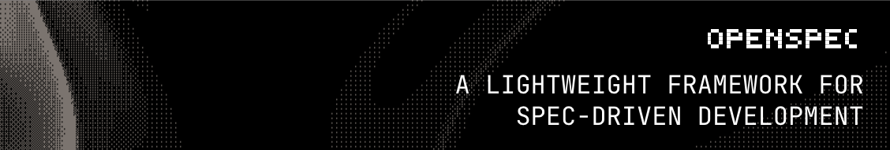

<p align="center">
  <a href="https://github.com/joelsebbu/OpenSpec">
    <picture>
      <source srcset="assets/openspec_bg.png">
      
    </picture>
  </a>
</p>

<p align="center">
  <a href="https://github.com/joelsebbu/OpenSpec/actions/workflows/ci.yml"></a>
  <a href="https://www.npmjs.com/package/officespec"></a>
  <a href="./LICENSE"></a>
  <a href="https://discord.gg/YctCnvvshC"></a>
</p>

<details>
<summary><strong>The most loved spec framework.</strong></summary>

[](https://github.com/joelsebbu/OpenSpec/stargazers)
[](https://www.npmjs.com/package/officespec)
[](https://github.com/joelsebbu/OpenSpec/graphs/contributors)

</details>
<p></p>
Our philosophy:

```text
→ fluid not rigid
→ iterative not waterfall
→ easy not complex
→ built for existing work not just blank slates
→ scalable from personal tasks to enterprises
```

> [!TIP]
> **New workflow now available!** We've rebuilt OfficeSpec with a new artifact-guided workflow.
>
> Run `/opsx:propose "your idea"` to get started. → [Learn more here](docs/opsx.md)

<p align="center">
  Follow <a href="https://x.com/0xTab">@0xTab on X</a> for updates · Join the <a href="https://discord.gg/YctCnvvshC">OfficeSpec Discord</a> for help and questions.
</p>

<!-- TODO: Add GIF demo of /opsx:propose → /opsx:archive workflow -->

## See it in action

```text
You: /opsx:explore
AI:  What would you like to explore?
You: Our expense approvals take too long and nobody knows the status.
AI:  Let me look at your current process and docs...
     Cleanest path here: a single request form + clear approval steps,
     with status visible to everyone. No new tools needed. Scope it?
You: Yes, let's do it.

You: /opsx:propose improve-expense-approvals
AI:  Created openspec/changes/improve-expense-approvals/
     ✓ proposal.md — why we're doing this, what's changing
     ✓ specs/       — requirements and scenarios
     ✓ design.md    — approach and plan
     ✓ tasks.md     — action checklist
     Ready to do the work!

You: /opsx:apply
AI:  Working through tasks...
     ✓ 1.1 Draft new expense request form
     ✓ 1.2 Define approval steps and owners
     ✓ 2.1 Publish how-to guide for the team
     ✓ 2.2 Set up status tracking
     All tasks complete!

You: /opsx:archive
AI:  Archived to openspec/changes/archive/2025-01-23-improve-expense-approvals/
     Specs updated. Ready for the next change.
```

<details>
<summary><strong>What do the specs actually look like?</strong></summary>

Plain Markdown — requirements with concrete scenarios, no special syntax to learn. Here's what goes in the `specs/` folder created above:

```markdown
## ADDED Requirements

### Requirement: Expense status visibility
The process SHALL let requesters see the status of their expense request,
from submitted to approved or returned.

#### Scenario: Requester checks expense status
- **WHEN** the requester opens the expense tracker
- **THEN** the request shows its current step and who needs to act next
```

Your AI writes these; you review the plan before any work starts.

OfficeSpec is built with OfficeSpec — browse this repo's live [specs](openspec/specs) and in-flight [changes](openspec/changes) for real examples at scale.

</details>

<details>
<summary><strong>OfficeSpec Dashboard</strong></summary>

<p align="center">
  
</p>

</details>

## Why teams adopt OfficeSpec

Solo, OfficeSpec keeps you and your AI honest on a single piece of work. On a team, the hard part moves: a change spans finance, operations, and marketing; requirements are owned by one team and used by others; planning starts before any work exists.

**[Stores](docs/stores-beta/user-guide.md)** are the answer — planning in a folder of its own. The same `openspec/` shape you already know (specs and changes), shared by `git push` like anything else. One source of truth your whole team and every AI assistant can read, across every team.

- **Cross-team changes** — one change, one plan, even when the work lands in three teams.
- **Shared requirements** — an operations team owns the specs; other teams reference them read-only, right where their AI assistant can read them. No drifting wiki.
- **Plan before work** — capture the plan in the store now; the teams catch up later.

> Stores are in **beta**. Start with the [Stores User Guide](docs/stores-beta/user-guide.md).

## Quick Start

**Requires Node.js 20.19.0 or higher.**

Install OfficeSpec globally:

```bash
npm install -g officespec@latest
```

> **Name compatibility:** the product is now **OfficeSpec**, but the technical names stay `openspec` so existing setups keep working — the `openspec/` folder, the `openspec` CLI (also installed as `officespec`; both run the same tool), the `/opsx:` slash commands, and the `openspec-*` skills are all unchanged.

Then navigate to your work folder and initialize:

```bash
cd your-work-folder
openspec init
```

> **Want your AI to do it?** Paste the [setup prompt](docs/installation.md#install-with-your-ai-assistant) into your AI assistant — it installs the CLI, runs `openspec init`, and verifies the result.

Now talk to your AI:

- **Not sure what to do yet?** Start with `/opsx:explore`, a no-stakes thinking partner that reviews your files and docs, weighs options, and shapes a plan before anything is done. ([Explore guide](docs/explore.md))
- **Already know what you want?** Go straight to `/opsx:propose <what-you-want-to-do>`.

Both are in the default profile. If you want the expanded workflow (`/opsx:new`, `/opsx:continue`, `/opsx:ff`, `/opsx:verify`, `/opsx:bulk-archive`, `/opsx:onboard`), select it with `openspec config profile` and apply with `openspec update`.

`/opsx:propose` is the canonical name; your tool may spell it `/opsx-propose` (Cursor, GitHub Copilot), `@opsx-propose` (Amazon Q) or `$openspec-propose` (Codex). `openspec init` prints the right form for the tools you picked — see [How To Invoke](docs/supported-tools.md#how-to-invoke).

> [!NOTE]
> Not sure if your tool is supported? [View the full list](docs/supported-tools.md) – we support 30+ tools and growing.
>
> Also works with pnpm, yarn, bun, and nix. [See installation options](docs/installation.md).

## Docs

**Start here:** the **[Documentation Home](docs/README.md)** maps everything. New to OfficeSpec? Read [Getting Started](docs/getting-started.md), then [How Commands Work](docs/how-commands-work.md) (where you actually type `/opsx:propose`).

→ **[Getting Started](docs/getting-started.md)**: first steps<br>
→ **[Explore First](docs/explore.md)**: think it through with `/opsx:explore` before you commit<br>
→ **[How Commands Work](docs/how-commands-work.md)**: where slash commands run vs the CLI<br>
→ **[Core Concepts at a Glance](docs/overview.md)**: the whole mental model, one page<br>
→ **[Examples & Recipes](docs/examples.md)**: real changes, start to finish<br>
→ **[Workflows](docs/workflows.md)**: combos and patterns<br>
→ **[Existing Work](docs/existing-projects.md)**: adopt OfficeSpec for work already in flight<br>
→ **[Editing a Change](docs/editing-changes.md)**: update artifacts, go back, reconcile manual edits<br>
→ **[Commands](docs/commands.md)**: slash commands & skills<br>
→ **[CLI](docs/cli.md)**: terminal reference<br>
→ **[Stores](docs/stores-beta/user-guide.md)**: plan in a separate repo, shared across your team (beta)<br>
→ **[Supported Tools](docs/supported-tools.md)**: tool integrations & install paths<br>
→ **[Concepts](docs/concepts.md)**: how it all fits<br>
→ **[Multi-Language](docs/multi-language.md)**: multi-language support<br>
→ **[Customization](docs/customization.md)**: make it yours<br>
→ **[Community Showcase](docs/community.md)**: projects and resources built with and for OfficeSpec<br>
→ **[FAQ](docs/faq.md)** · **[Troubleshooting](docs/troubleshooting.md)** · **[Glossary](docs/glossary.md)**: quick help


## Community schemas

Third-party schema bundles distributed via standalone repositories — these provide opinionated workflows that integrate OfficeSpec with other tools, similar to how [github/spec-kit's community extension catalog](https://github.com/github/spec-kit/tree/main/extensions) handles tool integrations.

→ **[Browse the catalog](docs/customization.md#community-schemas)** in the customization docs.


## Why OfficeSpec?

AI assistants are powerful but unpredictable when requirements live only in chat history. OfficeSpec adds a lightweight spec layer so you agree on what to do before any work starts.

- **Agree before you do** — human and AI align on specs before work begins
- **Stay organized** — each change gets its own folder with proposal, specs, plan, and tasks
- **Work fluidly** — update any artifact anytime, no rigid phase gates
- **Use your tools** — works with 30+ AI assistants via slash commands

### How we compare

**vs. [Spec Kit](https://github.com/github/spec-kit)** (GitHub) — Thorough but heavyweight. Rigid phase gates, lots of Markdown, Python setup. OfficeSpec is lighter and lets you iterate freely.

**vs. [Kiro](https://kiro.dev)** (AWS) — Powerful but you're locked into their IDE and limited to Claude models. OfficeSpec works with the tools you already use.

**vs. nothing** — AI work without specs means vague prompts and unpredictable results. OfficeSpec brings predictability without the ceremony.

## Updating OfficeSpec

**Upgrade the package**

```bash
npm install -g officespec@latest
```

**Refresh agent instructions**

Run this inside each project to regenerate AI guidance and ensure the latest slash commands are active:

```bash
openspec update
```

## Usage Notes

**Model selection**: OfficeSpec works best with high-reasoning models. We recommend Codex 5.5 and Opus 4.7 for both planning and delivery.

**Context hygiene**: OfficeSpec benefits from a clean context window. Clear your context before starting the work and maintain good context hygiene throughout your session.

## Contributing

Open a discussion (for core design changes) or an issue before you open a PR, and link the issue or discussion from the PR. New workflows, significant refactors, and structural changes need an OfficeSpec change proposal first.

→ **[CONTRIBUTING.md](CONTRIBUTING.md)**: the full process, from first issue to merged PR

## Other

<details>
<summary><strong>Telemetry</strong></summary>

OfficeSpec collects anonymous usage stats.

We collect only command names and version to understand usage patterns. No arguments, paths, content, or PII. Automatically disabled in CI.

**Opt-out (any one is enough):**
- `openspec config set telemetry.enabled false` (global config; unset means on)
- `export OPENSPEC_TELEMETRY=0` or `export DO_NOT_TRACK=1` (env overrides config)

</details>

<details>
<summary><strong>Maintainers & Advisors</strong></summary>

See [MAINTAINERS.md](MAINTAINERS.md) for the list of core maintainers and advisors who help guide the project.

</details>


## License

MIT
