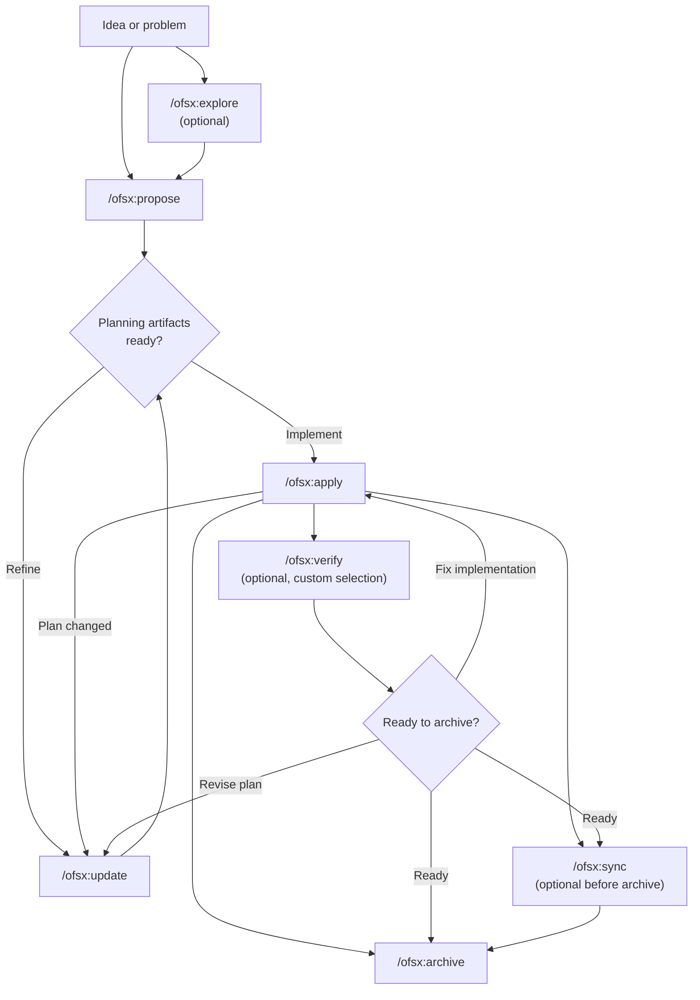
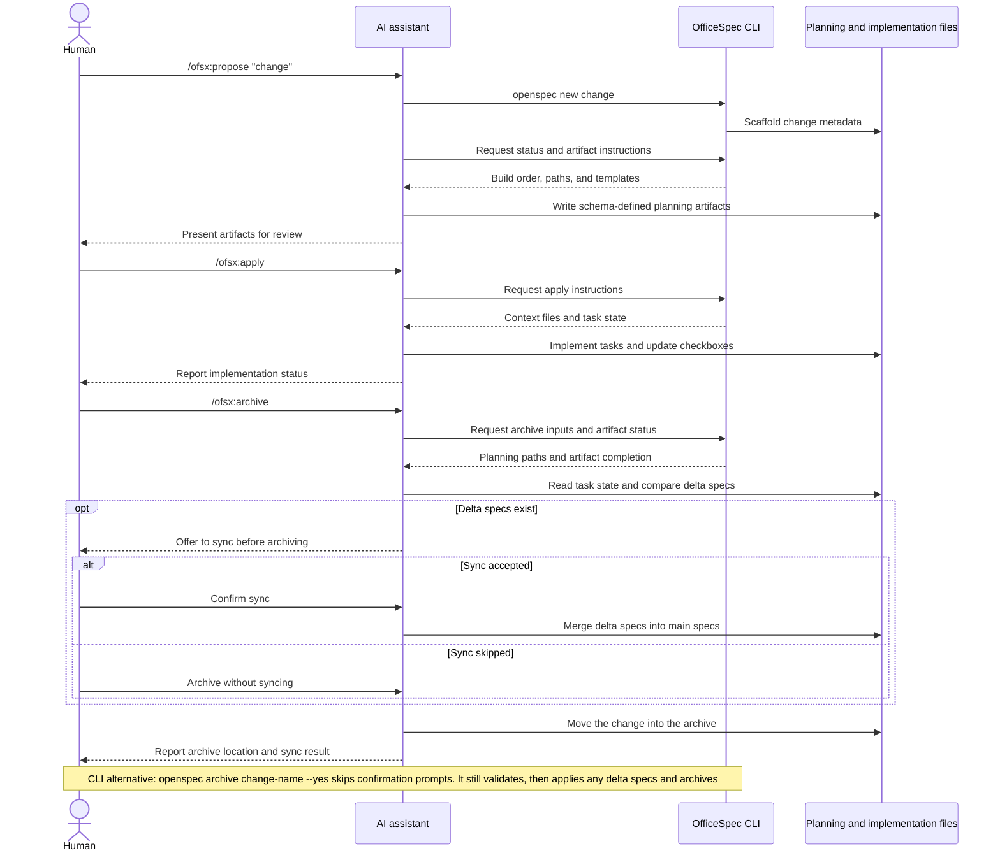

# Workflows

This guide covers common workflow patterns for OfficeSpec and when to use each one. For basic setup, see [Getting Started](getting-started.md). For command reference, see [Commands](commands.md).

## Philosophy: Actions, Not Phases

Traditional workflows force you through phases: planning, then implementation, then done. But real work doesn't fit neatly into boxes.

OFSX takes a different approach:

```text
Traditional (phase-locked):

  PLANNING ────────► IMPLEMENTING ────────► DONE
      │                    │
      │   "Can't go back"  │
      └────────────────────┘

OFSX (fluid actions):

  proposal ──► specs ──► design ──► tasks ──► do
```

**Key principles:**

- **Actions, not phases** - Commands are things you can do, not stages you're stuck in
- **Dependencies are enablers** - They show what's possible, not what's required next

> **Customization:** OFSX workflows are driven by schemas that define artifact sequences. See [Customization](customization.md) for details on creating custom schemas.

## Workflow at a Glance

The default workflow stays fluid: exploration and verification are optional, and
you can update planning artifacts whenever doing the work reveals something new.



The AI assistant drives the workflow, while the CLI provides deterministic
scaffolding, status, and artifact instructions:



## Two Modes

### Default Quick Path (`core` profile)

New installs default to `core`, which provides:
- `/ofsx:explore`
- `/ofsx:propose`
- `/ofsx:apply`
- `/ofsx:update`
- `/ofsx:sync`
- `/ofsx:archive`

Typical flow:

```text
/ofsx:explore ──► /ofsx:propose ──► /ofsx:apply ──► /ofsx:sync ──► /ofsx:archive
  (optional)
```

#### Start by exploring (the habit worth forming)

`/ofsx:explore` is part of the default profile, not an advanced add-on. It's the move to make whenever you have a problem but not yet a plan, which, with an AI assistant, is most of the time.

```text
You: /ofsx:explore

AI:  What would you like to explore?

You: Our search results feel stale. I'm not sure if it's caching,
     indexing, or the query itself.

AI:  Let me look... [reads the search service and cache layer]
     It's the index: it only rebuilds nightly, so edits don't show
     up until the next day. Two options: rebuild on write (simple,
     more load) or a short-TTL cache invalidation (more moving parts,
     less load). Given your write volume is low, rebuild-on-write is
     the cleaner fix. Want to scope it?

You: Yes.

You: /ofsx:propose rebuild-search-index-on-write
```

Explore creates no artifacts and writes no code. It's a free, no-stakes conversation that turns a vague worry into a precise change, so the proposal that follows is sharp. Already know exactly what you want? Skip it and go straight to `/ofsx:propose`. Full guide: [Explore First](explore.md).

### Expanded/Full Workflow (custom selection)

If you want explicit scaffold-and-build commands (`/ofsx:new`, `/ofsx:continue`, `/ofsx:ff`, `/ofsx:verify`, `/ofsx:bulk-archive`, `/ofsx:onboard`), enable them with:

```bash
openspec config profile
openspec update
```

## Workflow Patterns (Expanded Mode)

### Quick Feature

When you know what you want to build and just need to execute:

```text
/ofsx:new ──► /ofsx:ff ──► /ofsx:apply ──► /ofsx:verify ──► /ofsx:archive
```

**Example conversation:**

```text
You: /ofsx:new add-logout-button

AI:  Created openspec/changes/add-expense-checklist/
     Ready to create: proposal

You: /ofsx:ff

AI:  Creating all planning artifacts...
     ✓ proposal.md
     ✓ specs/
     ✓ design.md
     ✓ tasks.md
     Ready to do the work!

You: /ofsx:apply

AI:  Working through tasks...
     ✓ Added logout button to header
     ✓ Implemented session clearing
     ✓ Added confirmation dialog
     All tasks complete!

You: /ofsx:archive

AI:  ✓ Merged specs
     ✓ Archived change
```

**Best for:** Small to medium features, bug fixes, straightforward changes.

### Exploratory

When requirements are unclear or you need to investigate first:

```text
/ofsx:explore ──► /ofsx:new ──► /ofsx:continue ──► ... ──► /ofsx:apply
```

**Example conversation:**

```text
You: /ofsx:explore

AI:  What would you like to explore?

You: I want to improve page load performance but I'm not sure
     where the bottlenecks are.

AI:  Let me help investigate...
     [Analyzes bundle sizes, identifies slow queries, reviews
     component render patterns]

     I found three main bottlenecks:
     1. Large unoptimized images
     2. Synchronous data fetching in ProductList
     3. Re-renders from context changes

     Which would you like to address first?

You: Let's tackle the data fetching issue.

You: /ofsx:new optimize-product-list-fetching

AI:  Created change. Ready to create: proposal

You: /ofsx:continue

AI:  Creating proposal based on our exploration...
     [Writes proposal incorporating investigation insights]

     Ready to create: specs, design
     Which would you like next?

You: /ofsx:continue

AI:  Creating specs...
```

**Best for:** Performance optimization, debugging, architectural decisions, unclear requirements.

### Parallel Changes

Work on multiple changes at once:

```text
Change A: /ofsx:new ──► /ofsx:ff ──► /ofsx:apply (in progress)
                                         │
                                    context switch
                                         │
Change B: /ofsx:new ──► /ofsx:ff ──────► /ofsx:apply
```

**Example conversation:**

```text
You: I'm working on add-dark-mode but got pulled into a bug fix

You: /ofsx:new fix-login-redirect

AI:  Created openspec/changes/fix-login-redirect/

You: /ofsx:ff

AI:  ✓ Created planning artifacts

You: /ofsx:apply

AI:  Working on fix-login-redirect...
     [Implements the fix]
     All tasks complete!

You: /ofsx:archive

AI:  ✓ Archived fix-login-redirect

You: Let's get back to dark mode

You: /ofsx:apply improve-expense-approvals

AI:  Resuming add-dark-mode...
     Picking up at task 2.3: Update Header...
```

**Best for:** Parallel work streams, urgent interrupts, team collaboration.

When you have multiple completed changes, use `/ofsx:bulk-archive`:

```text
You: /ofsx:bulk-archive

AI:  Found 3 completed changes:
     - add-dark-mode (all tasks done)
     - fix-login-redirect (all tasks done)
     - update-footer (all tasks done)

     Checking for spec conflicts...
     ⚠ add-dark-mode and update-footer both touch specs/ui/

     Inspecting workspace to resolve...
     Both changes are implemented. Will apply in chronological order.

     Archive all 3 changes?

You: Yes

AI:  ✓ Archived add-dark-mode
     ✓ Archived fix-login-redirect
     ✓ Archived update-footer
     Specs merged in order: add-dark-mode → update-footer
```

Bulk archive detects when multiple changes touch the same specs and resolves conflicts by checking what's actually implemented.

### Completing a Change

The recommended completion flow:

```text
/ofsx:apply ──► /ofsx:verify ──► /ofsx:archive
                    │                 │
              validates          prompts to sync
              implementation     if needed
```

#### Verify: Check Your Work

`/ofsx:verify` validates implementation against your artifacts across three dimensions:

```text
You: /ofsx:verify

AI:  Verifying add-auth...

     COMPLETENESS
     ✓ All 12 tasks in tasks.md are checked
     ✓ All requirements in specs have corresponding code
     ⚠ Scenario "Session timeout after inactivity" not tested

     CORRECTNESS
     ✓ Implementation matches spec intent
     ✓ Edge cases from scenarios are handled
     ✓ Error states match spec definitions

     COHERENCE
     ✓ Design decisions reflected in code structure
     ✓ Naming conventions consistent with design.md
     ⚠ Design mentions "event-driven" but implementation uses polling

     SUMMARY
     ─────────────────────────────
     Critical issues: 0
     Warnings: 2
     Ready to archive: Yes (with warnings)

     Recommendations:
     1. Add test for session timeout scenario
     2. Consider refactoring to event-driven as designed, or update design.md
```

**What verify checks:**

| Dimension | What it validates |
|-----------|------------------|
| Completeness | All tasks done, all requirements implemented, scenarios covered |
| Correctness | Implementation matches spec intent, edge cases handled |
| Coherence | Design decisions reflected in code, patterns consistent |

Verify won't block archive, but it surfaces issues you might want to address first.

#### Archive: Finalize the Change

`/ofsx:archive` completes the change and moves it to the archive:

```text
You: /ofsx:archive

AI:  Archiving add-auth...

     Artifact status:
     ✓ proposal.md exists
     ✓ specs/ exists
     ✓ design.md exists
     ✓ tasks.md exists (12/12 tasks complete)

     Delta specs: Not yet synced to main
     → Would you like to sync now?

You: Yes

AI:  ✓ Synced specs to openspec/specs/auth/spec.md
     ✓ Moved to openspec/changes/archive/2025-01-24-add-auth/

     Change archived successfully.
```

Archive will prompt if specs aren't synced. It won't block on incomplete tasks, but it will warn you.

## When to Use What

### `/ofsx:ff` vs `/ofsx:continue`

| Situation | Use |
|-----------|-----|
| Clear requirements, ready to build | `/ofsx:ff` |
| Exploring, want to review each step | `/ofsx:continue` |
| Want to iterate on proposal before specs | `/ofsx:continue` |
| Time pressure, need to move fast | `/ofsx:ff` |
| Complex change, want control | `/ofsx:continue` |

**Rule of thumb:** If you can describe the full scope upfront, use `/ofsx:ff`. If you're figuring it out as you go, use `/ofsx:continue`.

### When to Update vs Start Fresh

A common question: when is updating an existing change okay, and when should you start a new one?

**Update the existing change when:**

- Same intent, refined execution
- Scope narrows (MVP first, rest later)
- Learning-driven corrections (workspace isn't what you expected)
- Design tweaks based on implementation discoveries

**Start a new change when:**

- Intent fundamentally changed
- Scope exploded to different work entirely
- Original change can be marked "done" standalone
- Patches would confuse more than clarify

```text
                     ┌─────────────────────────────────────┐
                     │     Is this the same work?          │
                     └──────────────┬──────────────────────┘
                                    │
                 ┌──────────────────┼──────────────────┐
                 │                  │                  │
                 ▼                  ▼                  ▼
          Same intent?      >50% overlap?      Can original
          Same problem?     Same scope?        be "done" without
                 │                  │          these changes?
                 │                  │                  │
       ┌────────┴────────┐  ┌──────┴──────┐   ┌───────┴───────┐
       │                 │  │             │   │               │
      YES               NO YES           NO  NO              YES
       │                 │  │             │   │               │
       ▼                 ▼  ▼             ▼   ▼               ▼
    UPDATE            NEW  UPDATE       NEW  UPDATE          NEW
```

**Example: "Add dark mode"**

- "Need to also support custom themes" → New change (scope exploded)
- "System preference detection is harder than expected" → Update (same intent)
- "Let's ship toggle first, add preferences later" → Update then archive, then new change

## Best Practices

### Keep Changes Focused

One logical unit of work per change. If you're doing "add feature X and also refactor Y", consider two separate changes.

**Why it matters:**
- Easier to review and understand
- Cleaner archive history
- Can ship independently
- Simpler rollback if needed

### Use `/ofsx:explore` for Unclear Requirements

Before committing to a change, explore the problem space:

```text
You: /ofsx:explore

AI:  What would you like to explore?

You: How should we handle rate limiting for our API?

AI:  Let me investigate your current setup and options...
     [Researches workspace, considers patterns]

     I see three approaches we could take:
     1. Middleware-based (simple, per-endpoint)
     2. Redis-backed (scalable, shared state)
     3. Token bucket per user (fair, complex)

     Your current stack suggests #1 or #2. What's your scale?
```

Exploration clarifies thinking before you create artifacts.

### Verify Before Archiving

Use `/ofsx:verify` to check implementation matches artifacts:

```text
You: /ofsx:verify

AI:  Verifying add-dark-mode...

     ✓ All tasks in tasks.md are checked
     ✓ Requirements in specs have corresponding code
     ✓ Design decisions are reflected in implementation

     Ready to archive!
```

Catches mismatches before you close out the change.

### Name Changes Clearly

Good names make `openspec list` useful:

```text
Good:                          Avoid:
add-dark-mode                  feature-1
fix-login-redirect             update
optimize-product-query         changes
implement-2fa                  wip
```

## Command Quick Reference

For full command details and options, see [Commands](commands.md).

| Command | Purpose | When to Use |
|---------|---------|-------------|
| `/ofsx:propose` | Create change + planning artifacts | Fast default path (`core` profile) |
| `/ofsx:explore` | Think through ideas with the AI | Start here when unsure: unclear requirements, investigation, comparing options |
| `/ofsx:new` | Start a change scaffold | Expanded mode, explicit artifact control |
| `/ofsx:continue` | Create next artifact | Expanded mode, step-by-step artifact creation |
| `/ofsx:ff` | Create all planning artifacts | Expanded mode, clear scope |
| `/ofsx:apply` | Implement tasks | Ready to do the work |
| `/ofsx:verify` | Validate implementation | Expanded mode, before archiving |
| `/ofsx:sync` | Merge delta specs | Expanded mode, optional |
| `/ofsx:archive` | Complete the change | All work finished |
| `/ofsx:bulk-archive` | Archive multiple changes | Expanded mode, parallel work |

## Next Steps

- [Writing Good Specs](writing-specs.md) - What a strong requirement and scenario look like, and how to right-size a change
- [Reviewing a Change](reviewing-changes.md) - The two-minute pass on a drafted plan before any code
- [OfficeSpec on a Team](team-workflow.md) - How changes fit branches and pull requests
- [Commands](commands.md) - Full command reference with options
- [Concepts](concepts.md) - Deep dive into specs, artifacts, and schemas
- [Customization](customization.md) - Create custom workflows
